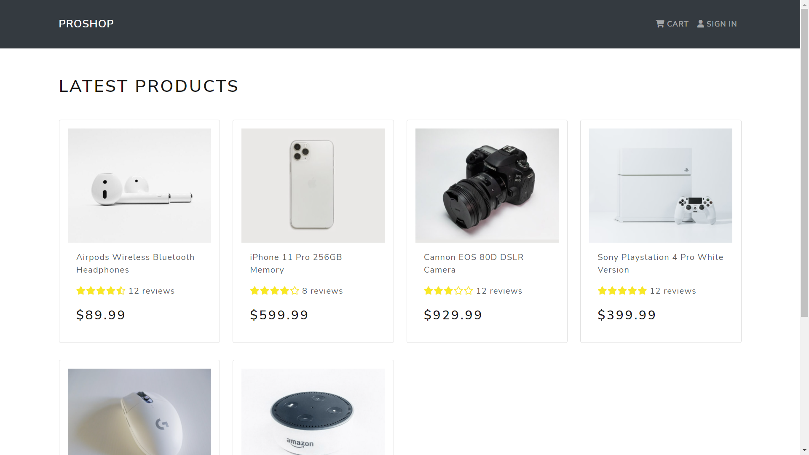

# Elecshop - eCommerce app w/ Next.js, Nest.js and MongoDB



## The Challenge ⚡️

I wanted to build another eCommerce website using newer technologies than my [previous eCommerce project](https://github.com/NightClover-code/basic-eCommerce-website), where I used `Firebase` to store data and `Redux` for state management.

I went with a `client-server` approach, and this time I mixed two frameworks for the first time, which were `Next.js` and `Nest.js`.

This project was very fun to build, as I encountred multiple challenges on how to coordinate between a fast, secure, and strictly-typed Nest.js API; and a Next.js app based on client-side fetching.

Here was the challenge:

- Server-side full-featured shopping cart from scratch.
- Storing product reviews and ratings for every customer.
- Adding pagination & searching features for products.
- User account management & saving product orders.
- Admin profile & product management.
- Fast checkout process (shipping, payment method, etc).

## Built With ✨

- [Nest.js](https://nestjs.com/) - node.js framework
- React Bootstrap - UI library
- Redux - State management library
- JWT - tokens for authentication
- [Next.js](https://nextjs.org/) - react.js framework
- MongoDB - Document database
- Typescript

## Running Locally 🖥️

Clone the project

```bash
git clone https://github.com/NightClover-code/modern-ecommerce.git
```

Go to the project directory

```bash
cd modern-ecommerce
```

Remove remote origin

```bash
git remote remove origin
```

Install dependencies - Client

```bash
yarn install
```

Install dependencies - Server

```bash
yarn install
```

Add Environment Variables - Client

<details>
  <summary>Click to expand!</summary>
  
  - `NEXT_PUBLIC_PAYPAL_CLIENT_ID`
</details>

Add Environment Variables - Server

<details>
  <summary>Click to expand!</summary>
  
  - `MONGODB_PASSWORD`
  - `MONGODB_DATABASE_NAME` 
  - `JWT_SECRET`
  - `MONGODB_URL` 
  - `SESSION_KEY`
  - `CLIENT_URL`
  - `CLOUDINARY_API_KEY`
  - `CLOUDINARY_API_SECRET`
  - `CLOUDINARY_NAME`
</details>

Start the server

```bash
yarn start:dev
```

Start the client

```bash
yarn dev
```

## Deployment 🚀
 - Client deployed on [Vercel](https://vercel.com/)
 - Server deployed on [Railway](https://railway.app/)
 
 
## Inspiration & credits ☄️
 - [@bradtraversy](https://www.youtube.com/@TraversyMedia) - project idea
 - [@satnaing](https://github.com/satnaing) - readme format

## Author
- [@achrafdev](https://achrafdev.com)

**Thanks for sharing** 🚀

