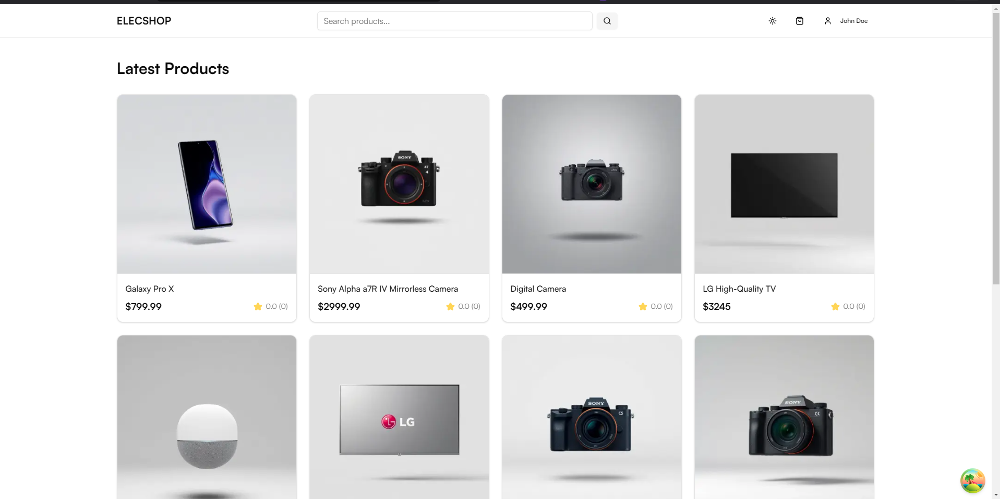

# Elecshop - Modern eCommerce Platform

A full-stack eCommerce platform built with Next.js, Nest.js, and MongoDB, featuring AI-powered product management and modern authentication.



## Features 🚀

### Core Features
- Full-featured shopping cart with:
  - server-side persistence for logged in users
  - local storage for guests
- Product reviews and ratings system
- Advanced product search with pagination
- User account management & order history
- Secure authentication with JWT (access & refresh tokens)
- Role-based access control (Admin/User)

### AI-Powered Features
- AI Product Creator for generating product listings (Vercel AI SDK)
- Image generation for product images (using Replicate)
- Product Development Expert chat interface
- Smart product recommendations

### Technical Highlights
- Modern monorepo structure with apps for web and server
- Type-safe API communication with shared types
- Real-time updates using modern state management
- Cloudinary integration for image management
- Secure payment processing with PayPal and Stripe
- Modern UI with Shadcn components and Tailwind CSS

## Tech Stack 💻

### Frontend
- Next.js 15 with App Router
- TypeScript
- Tailwind CSS
- Shadcn UI Components
- Framer Motion for animations
- Chat interface with Vercel AI SDK

### Backend
- Nest.js with TypeScript
- MongoDB with Mongoose
- JWT Authentication
- Swagger API Documentation
- Argon2 for password hashing
- Cloudinary for media storage
- OpenAI integration
- Text Vercel AI SDK
- Replicate for image generation

### DevOps & Tools
- Monorepo architecture
- pnpm for package management
- Docker support
- Railway for backend deployment
- Vercel for frontend deployment

## Getting Started 🏃

### Prerequisites
- Node.js (v16 or higher)
- pnpm (preferred package manager)
- MongoDB instance
- Cloudinary account
- OpenAI API key

### Installation

1. Clone the repository

## Built With ✨

- [Nest.js](https://nestjs.com/) - node.js framework
- React Bootstrap - UI library
- Redux - State management library
- JWT - tokens for authentication
- [Next.js](https://nextjs.org/) - react.js framework
- MongoDB - Document database
- Typescript

## Running Locally 🖥️

Clone the project

```bash
git clone https://github.com/NightClover-code/modern-ecommerce.git
```

Go to the project directory

```bash
cd modern-ecommerce
```

Remove remote origin

```bash
git remote remove origin
```

Install dependencies - Client

```bash
yarn install
```

Install dependencies - Server

```bash
yarn install
```

Add Environment Variables - Client

<details>
  <summary>Click to expand!</summary>
  
  - `NEXT_PUBLIC_PAYPAL_CLIENT_ID`
</details>

Add Environment Variables - Server

<details>
  <summary>Click to expand!</summary>
  
  - `MONGODB_PASSWORD`
  - `MONGODB_DATABASE_NAME` 
  - `JWT_SECRET`
  - `MONGODB_URL` 
  - `SESSION_KEY`
  - `CLIENT_URL`
  - `CLOUDINARY_API_KEY`
  - `CLOUDINARY_API_SECRET`
  - `CLOUDINARY_NAME`
</details>

Start the server

```bash
yarn start:dev
```

Start the client

```bash
yarn dev
```

## Deployment 🚀
 - Client deployed on [Vercel](https://vercel.com/)
 - Server deployed on [Railway](https://railway.app/)
 
 
## Inspiration & credits ☄️
 - [@bradtraversy](https://www.youtube.com/@TraversyMedia) - Project Idea
 - [@satnaing](https://github.com/satnaing) - README format

## Author
- [@achrafdev](https://achrafdev.com)

**Thanks for sharing** 🚀

